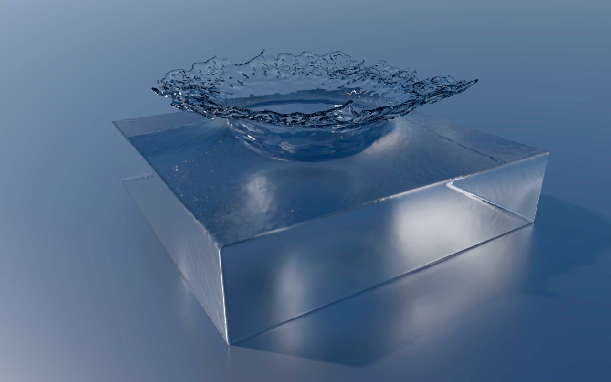
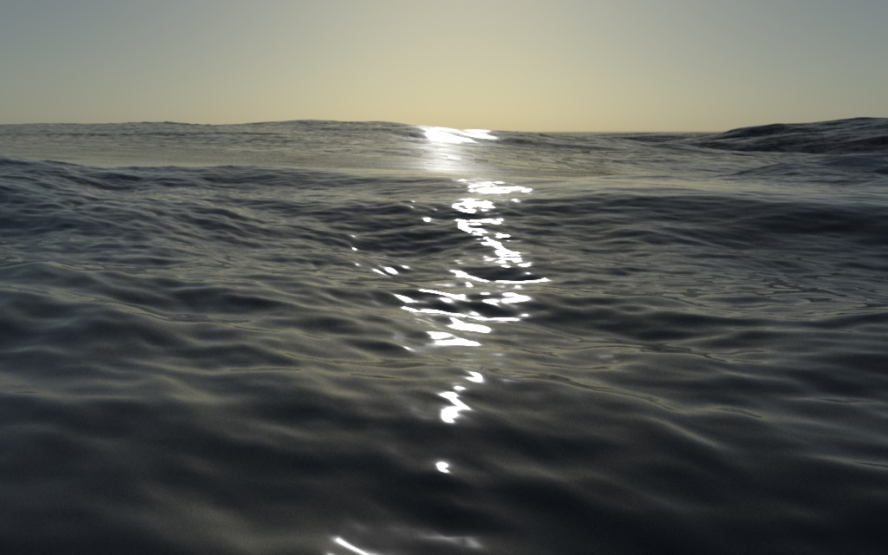

**EDXFluids** is a fully featured fluid simulator independently developed by [Edward Liu](http://behindthepixels.io/). It's built with C++ with multithreading support. EDXFluids heavily uses template in all of its data containers and algorithms so it can easily instantiate simulators of different dimensions. Development process is tremendously benefited from this since it is really simple to debug and visualize new algorithms in 2 dimensional simulations before trivially changing it to 3 dimensional. Currently, the simulator is capable of simulating smoke and liquid as well as their interaction with static solid objects.

The source code of EDXFluids is highly self-contained and does not depend on any external library other than [EDXUtil](https://github.com/behindthepixels/EDXUtil), which is a utility library developed by Edward Liu.

EDXFluids is currently built and tested only on Windows platform. Developer using Visual Studio 2015 should be able to build the source code immediately after syncing. Porting to Linux or macOS should not be difficult since it there is no external dependency.

## List of Features

- Conjugate Gradient with Incomplete Cholesky Preconditioning
- Gause Sedel
- Semi-Lagrangian
- MacCormack / BFECC
- Higher order interpolation
- Variational Solver for Accurate Boundary with Coarse Simulation Resolution
  - See [A Fast Variational Framework for Accurate Solid-Fluid Coupling](https://cs.uwaterloo.ca/~c2batty/papers/Batty07.pdf)
- FLIP/PIC
- Narrow Band Level Set Surface Tracking
- Surface Reconstruction from Particles with Marching Cubes
- Ocean Simulation with FFT
- Visualization with Stream Particles

## Results
  
*Smoke passing through a sphere, simulated with EDXFluids, rendered with [EDXRay](http://behindthepixels.io/EDXRay/)*

  
*Ocean simulated with EDXFluids, rendered with [EDXRay](http://behindthepixels.io/EDXRay/)*
